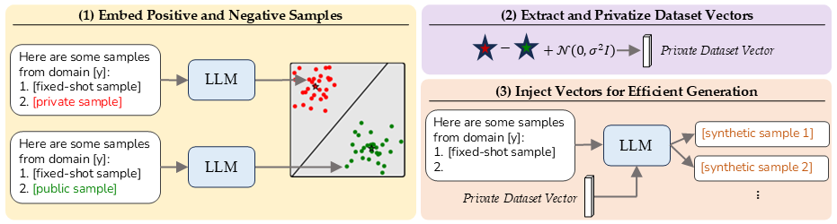

# EPSVec: Efficient and Private Synthetic Data Generation via Dataset Vectors

This directory implements EPSVec: *E*fficient and *P*rivate *S*ynthetic data generation via dataset *Vec*tors. 

<p align="center">
  
</p>

### Features

- **Scales like standard decoding:** generate arbitrarily many samples and long sequences with inference efficiency comparable to standard generation.
- **Effective privacy in low-data settings:** strong distributional fidelity gains with especially large improvements when private data are scarce.

## Experiments
To run our code, first create a new conda env and install the requirements:

```
conda create --name epsvec python=3.11
conda activate epsvec
pip install -r requirements.txt
```

The first step to reproduce our results is to generate synthetic imdb data using the 2-fixed-shots baseline, with 1K samples per-class:

```
python main.py --dataset=imdb --method=Few --n_fixed_shots=2 --count=1000 --fixed_shots_epsilon=0.1
```

The generated data can be found under the ```results/``` directory. The next step is to extract the steering vector:

```
python generate_steer_vecs.py --dataset=imdb --neg_data_count=1000 --bs=1 --clip=True --n_fixed_shots=2 --neg_data_fixed_shots_epsilon=0.1
```

The above code extracts the vectors and writes them under ```steer_vectors/``` directory.

Finally, we can use the generated vectors to run EPSVec with ```epsilon = 5.0```:

```
python main.py --dataset=imdb --method=VI --n_fixed_shots=2 --count=1000 --fixed_shots_epsilon=0.1 --epsilon=5.0 
```

where the resukts including the raw samples, MAUVE score, BERT Acc., ... are stored likewise under the ```results/``` folder.
